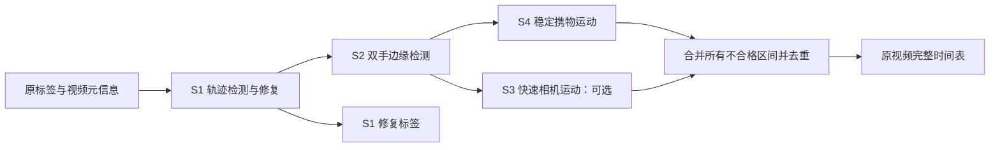

# EgoStandard 标签修复与不合格时间表管线

版本：`egostandard-labels-and-timelines-v2-independent-union`。

S1、S2 依次执行；S4、S3 在 **同一份 S1/S2 保留轨迹**上独立检测，然后合并不合格区间。S3 可选。输出 S1 修复标签和逐原视频的完整合格／不合格时间表。



S4 先计算，S3 随后计算，二者都使用 S2 之后的连续保留区间。S3 的短暂命中不会打断 S4 的长窗口；S4 的标记也不会遮掉 S3 的边界窗口。S1/S2 不合格区间会加入最终并集。所有窗口均不跨越 S1/S2 已标记的间隙，没有 S5。

## 当前规则

| 规则 | 条件 |
| --- | --- |
| S1 | MINT block + Hampel 轨迹异常检测；有两侧有效端点且异常长度 ≤30 帧时，位置线性插值、旋转 SO(3) SLERP。无法修复的帧标记不合格。原行与无法修复的原值保留，输出相应无效标记。 |
| S2 | 双手同时位于画面外或 5% 边缘，连续 ≥2 秒。通过 EEF 与相机标定几何投影判断。 |
| S3（默认启用） | 0.2 秒（30 FPS 下间隔 6 帧）首尾相机平移 **>7.5 cm** 或相对 SO(3) 旋转 **>7.5°**。阈值可通过参数设置。 |
| S4 | 1 秒窗口中，双手各自相对相机光轴的余弦 P95−P5 ≤0.03，且首尾相机平移 **>20 cm** 或旋转 **>20°**；每个分支独立连续命中 ≥1 秒，最后取并集。 |

S3、S4 标记命中窗口的全部证据帧，包括两端；不额外扩张或填补正长度间隙。S4 的连续命中条件指 30 个连续窗口起点，最短完整证据区间为 60 帧（2 秒）。S4 旋转分支沿用 `1e-5°` 数值容差。

在输入与 S4 参数固定时，提高 S3 的平移／旋转阈值后，最终不合格集合只能缩小或不变。合格区间的数量本身不保证单调变化。S4 的独立命中结果在启用／跳过 S3 或改变 S3 阈值时保持一致。

## 安装与运行

```bash
git clone https://github.com/rykflashv17-cr/egostandard-annotation-pipeline.git
cd egostandard-annotation-pipeline
python -m pip install -r requirements.lock.txt
python -m unittest discover -s tests -p 'test_*.py' -v
python run.py --source /path/to/stage_a_aligned --output /path/to/work/labels_annotations --workers 64
```

请使用 Python 3.12。已在 Python 3.12.8、NumPy 2.5.2、SciPy 1.18.1、PyArrow 25.0.1 上验证。

开发机最终程序：`/mnt/pfs/Data/ryk/egostandard/program/`。

默认输入：

```text
/mnt/pfs/datasets/Processed/Egostandard_stageA_260915_delay1_trunc/stage_a_aligned
```

默认输出：`/mnt/pfs/Data/ryk/egostandard/runs/labels_annotations_independent_20260928/`。

```bash
bash /mnt/pfs/Data/ryk/egostandard/program/run.sh --workers 64

# S3 设为 15 cm / 15°：
bash /mnt/pfs/Data/ryk/egostandard/program/run.sh --workers 64 --s3-translation-cm 15 --s3-rotation-deg 15

# S3 设为 20 cm / 20°：
bash /mnt/pfs/Data/ryk/egostandard/program/run.sh --workers 64 --s3-translation-cm 20 --s3-rotation-deg 20

# 跳过 S3，在同一配置中共用已完成的 S1 标签：
bash /mnt/pfs/Data/ryk/egostandard/program/run.sh --workers 64 --skip-s3

# 同一版本、阈值与批次大小的任务中断后恢复：
bash /mnt/pfs/Data/ryk/egostandard/program/run.sh --workers 64 --resume
```

以上阈值示例用于选择一个配置。源码、阈值或算法版本改变时，使用 `--output` 指定新的输出目录。已有结果会校验配置指纹，避免混合版本。`--limit 256` 用于小规模验证；测试使用独立输出目录。`--batch-size` 默认 32，每个 worker 的 BLAS/OpenMP 线程为 1。

`PIPELINE_PYTHON` 可指定解释器，`PIPELINE_OUTPUT` 可指定输出目录。开发机默认复用 `/mnt/pfs/Data/wanghao/Data_Clean_StridingAI_Ego/.venv_root_miniforge/` 中的环境。程序、日志、测试和半成品统一放在 Data/ryk。

## 输出

```text
labels_annotations_independent_20260928/
  config.json                       # 源身份、代码哈希、阈值、独立检测策略与版本
  labels_s1/
    data/chunk-xxx/file-xxx.parquet  # 每个原 episode 一份修复标签
    meta/                           # 标签元信息、原 episode/source 映射
    manifest.jsonl                  # 源身份、新标签哈希、修复细节与 S1 不合格区间
    COMPLETE.json
  annotations/
    with_s3/
      plan.jsonl                    # 原 episode、视频路径、主归因与全部规则命中
      timeline.csv.gz               # 完整合格／不合格时间表
      rejected_intervals.csv.gz     # 仅不合格区间
      episodes.csv.gz               # 标签和两个原 MP4 的对应关系
      summary.json                  # 独立命中、互斥归因、重叠与总量统计
      timings.json                  # 总墙钟耗时、worker 分环节累计耗时、主进程导出耗时
      COMPLETE.json
      checkpoints/
    without_s3/                     # --skip-s3；共用 labels_s1
  LATEST.json
```

### 时间表

CSV 保留原有的 `source_episode_index`、`start_frame`、`end_frame_exclusive`、起止秒、时长、`status`、`stage`、`reason`、双路 MP4 起止时间偏移；增加：

- `matched_stages`：全部命中的规则，用分号连接，例如 `S4;S3`。
- `matched_reasons`：对应的全部原因，例如 `S4_stable_hands_camera_translation;S3_camera_rotation`。

同一帧的主归因优先级为 **S1 → S2 → S4 → S3**，记在 `stage/reason`。全部命中信息会保留在新列里。总不合格时长按并集计算，重叠帧只计一次。合格行的主归因和命中列表为空。

区间为 **[start, end)**，帧编号是权威依据，秒数按 30 FPS 写六位小数。例如 `[210,240)` 为原视频 7.0–8.0 秒的 30 帧。每条原视频从第 0 帧至结尾均被时间表完整覆盖。

`plan.jsonl` 的 `timeline` 保持 `[起帧, 结束帧（不含）, 主归因编号, 主原因编号]` 格式；增加同分段的 `rule_timeline`，格式为 `[起帧, 结束帧（不含）, 全部原因编号列表]`。例如 `[210,240,[41,32]]` 表示同时命中 S4 平移与 S3 旋转，主归因是 S4。原因编号见 `pipeline.py` 的 `REASONS`。时间表会在任一规则／分支发生变化时分段，即使主归因不变也保留边界。

`episodes.csv.gz` 和 `plan.jsonl` 记录两路原 MP4 的路径与时间偏移。帧率为原始 30 FPS；此前预览每秒 5 帧不改变时间表帧率。

### 统计

每条规则同时记录两类计数：

- `matched_frames / matched_seconds / matched_intervals`：该规则独立检测的完整命中，S3 与 S4 可能重叠。
- `removed_frames / removed_seconds / removed_intervals`：按主归因优先级分配给该规则的帧数与区间，各规则互斥，可直接相加得到总不合格时长。

`input_frames/segments` 和 `kept_frames/segments` 描述按主归因优先级应用标记后的状态；实际检测范围看 `detection_input_frames/segments`。启用 S3 时，它与 S4 的实际检测输入相同。

汇总中的 `s3_s4_overlap_frames/seconds` 单独记录两条规则的交集。每个 episode 也保存 `s3_s4_overlap_frames`。S3 的 `overlap_frames` 表示命中但已主归因给 S4 的帧数。`reason_removed_frames` 是互斥主归因计数，`reason_matched_frames` 是完整规则命中计数。

### 耗时记录

`timings.json` 与 `summary.json.timings` 记录总墙钟耗时，以及原标签读取、S1 检测／修复／校验、标签写入、回读逐列校验、SHA-256、S2/S4/S3 检测、区间合并与时间表校验的 worker 累计耗时。各 episode 的明细在 `plan.jsonl` 的 `label_timings_seconds`、`annotation_timings_seconds`、`episode_worker_seconds` 中；S1 manifest 仅保留标签部分。

worker 耗时含 I/O 等待，按 episode 累加。多个进程同时执行，因此不能把累计耗时当成每个阶段顺序运行的墙钟耗时，也不能与主进程导出时间相加得到总时间。主进程单独记录元信息准备、记录表导出、最后校验与校验和耗时。恢复任务时，检查点中的 episode 耗时保留原测量值；当前调用的墙钟耗时单独记录。复用已有 S1 标签时，不重复计入此前的 S1 导出耗时。

### 标签与训练读取

所有原始标签行、frame/episode 编号、timestamp、全局 index、摄像机、gripper 和原始手部特征保持对应。仅修复检测命中且可插值的 EEF 位置／旋转，action 随 delay1 目标同步修复。原文件保持只读，结果写入 `labels_s1`。

添加双手标记：`observation.state.eef_valid / eef_repaired / eef_anomaly_reason`、`action.eef_valid / eef_repaired / eef_anomaly_reason`，以及 `observation.state.hand_features_valid`。EEF 修复不会自动修复原始 keypoints；其可用性由 `hand_features_valid` 表示。

训练时，整个样本窗口应位于一个合格区间，并检查所需字段的有效标记。delay1 action 指向下一帧，无效 state 的前一帧即使为 keep，其 action 仍可能无效。自然末尾的外部 action 目标保留；无法修复时最后一帧归 S1 不合格。

标签输出没有视频，读取器按时间表路径访问原视频。原 EEF 统计没有作为修复后的统计导出；训练归一化应使用有效标签与最终合格时间表重新计算。

## 校验与恢复

- 功能测试覆盖独立检测的共同输入、双规则重叠、阈值单调性、S3 开关、S1 修复与 delay1 对齐、旧检查点拒绝和标签复用。
- 写标签后逐列读取校验并记录 SHA-256；源文件身份、完整时间轴、互斥归因和独立命中并集均校验守恒。
- 两个 S3 模式共用一份 S1 标签。S1 尚未完成时，先使用 `--resume` 完成当前模式。
- `--resume` 校验算法版本、参数、源文件和已输出标签身份。v1 串行版本的检查点不能用于 v2。全局校验成功后才发布 `COMPLETE.json`。
- 真实数据的集成核对脚本：`python tests/audit_integration.py --output /path/to/validation_output`；该输出应已完成 with_s3 和 without_s3 两个模式。

开发机验证目录为 `/mnt/pfs/Data/ryk/egostandard/runs/validation_independent_256_20260928/`。此目录只包含 256 条真实数据的验证产物。

`licenses/` 保留 MINT 上游许可和固定提交；`PROVENANCE.json` 记录规则来源与版本。独立检测逻辑在入口层实现。

已通过 10 项功能测试、256 条真实数据（203,988 帧）的两个 S3 模式集成核对，以及另外 20 条真实案例（33,583 帧）的 A/B/跳过 S3 回归检查。修复标签与此前 S1 输出字节一致。
